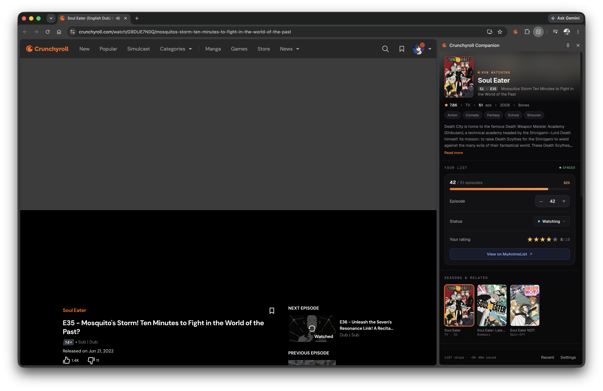
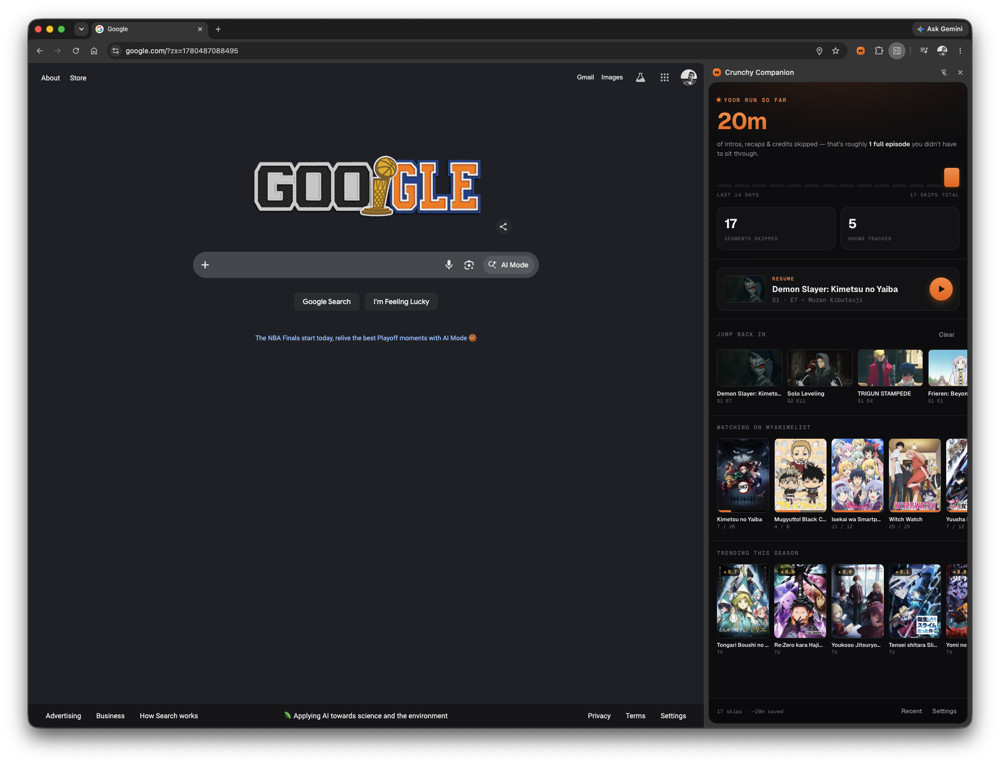
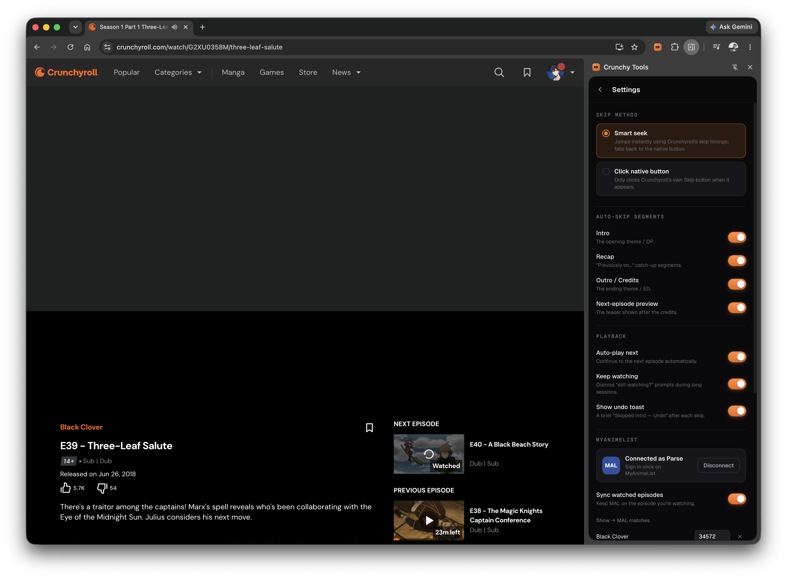
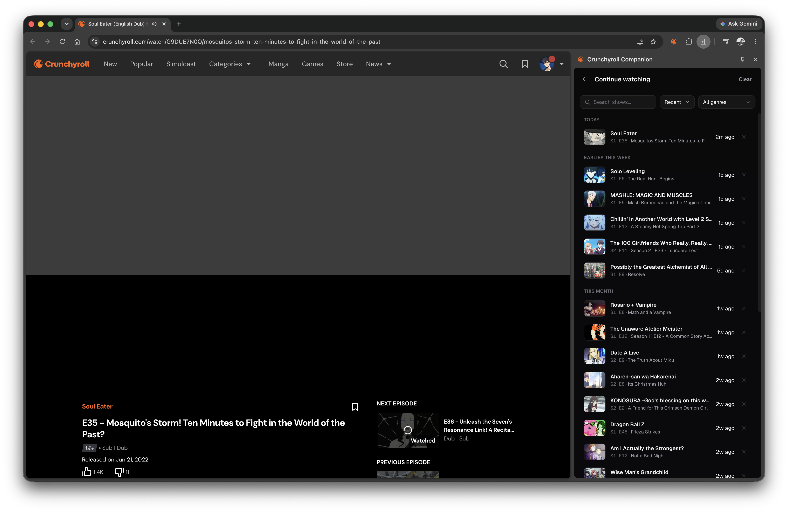

# Crunchy Companion

An all-in-one enhancement extension for [Crunchyroll](https://www.crunchyroll.com)
(Chrome / Edge, Manifest V3). Version **0.2.2**.

It lives in a persistent Chrome **side panel** that adapts to what you're doing:
a live show companion while you watch, and a home dashboard everywhere else.

<table>
  <tr>
    <td width="50%" valign="top">
      
      <br />
      <sub><b>On Crunchyroll</b> — the live show panel: now-playing hero, MyAnimeList
      sync, your episode/status/score, plus the show's synopsis, seasons, characters
      and reviews.</sub>
    </td>
    <td width="50%" valign="top">
      
      <br />
      <sub><b>Anywhere else</b> — the home dashboard: your skip stats and activity,
      a Resume card, Continue-watching, your MyAnimeList "watching" list, and what's
      trending this season.</sub>
    </td>
  </tr>
  <tr>
    <td width="50%" valign="top">
      
      <br />
      <sub><b>Settings</b> — skip method, per-segment auto-skip toggles, playback
      options, and your MyAnimeList connection — all inline in the panel.</sub>
    </td>
    <td width="50%" valign="top">
      
      <br />
      <sub><b>Continue watching</b> — your recently opened episodes, with one-click
      resume and per-entry remove.</sub>
    </td>
  </tr>
</table>

- **Auto-skip** intro, recap, outro/credits, and the next-episode preview — each
  independently toggleable.
- **Auto-play the next episode** when one finishes.
- **Keep watching**: dismisses Crunchyroll's "Are you still watching?" / profile
  prompts so a binge isn't interrupted.
- **MyAnimeList sync** (opt-in): keeps your MAL progress on the episode you're
  actually watching, with rich show details (synopsis, genres, seasons,
  characters, reviews) and inline controls to adjust episode / status / score.
- **Continue watching**: a Recent list of shows you've opened, with one-click
  resume and per-entry delete.
- A small **"Skipped intro — Undo"** toast so a skip never feels like a glitch,
  plus lifetime **skip stats** (time saved + an activity sparkline) on the home page.
- A persistent **side panel** and a full **options page**, with settings synced
  across your signed-in browsers via `chrome.storage.sync`.

> This is a personal, client-side enhancement that only automates actions you can
> already perform yourself (clicking *Skip* / *Next*). It does not bypass
> paywalls, DRM, or advertising.

## How skipping works

Crunchyroll publishes per-episode skip timings as static JSON — the same data
that powers its own **Skip Intro** button:

```
https://static.crunchyroll.com/skip-events/production/{episodeId}.json
```

The extension supports two methods (Options → *Skip method*):

- **Smart seek** (default): the background worker fetches that JSON and the
  content script seeks the `<video>` straight past each enabled segment. If an
  episode has no published data, it **falls back to clicking** Crunchyroll's
  native skip button.
- **Click native button**: only ever clicks Crunchyroll's own skip button.

Because Crunchyroll is a single-page app, the content script watches History API
navigation (and polls as a safety net) and re-initialises for each new episode
without a page reload.

## MyAnimeList sync

**Users** open Options → **MyAnimeList** → **Connect MyAnimeList**, log into their
own MAL account, and toggle **Sync watched episodes** on. Nothing else to set up.

- **Tracks the episode you're on.** A short way into each episode (~30s of
  playback, enough to confirm you're actually watching it) your MAL progress is
  set to that episode — so moving from episode 5 to 6 updates MAL to 6 rather than
  lagging a whole episode behind. Auto-sync only ever moves progress *forward*.
- **Manual control in the panel.** While on a watch page, the side panel shows a
  MAL card: a `–`/`+` (and type-to-set) episode stepper, status dropdown (Watching
  / Completed / …), a 1–10 star rating, and a link to the entry on MAL.
- **Accurate matching.** The CR series is resolved to a MAL anime by scoring
  candidate titles (exact title and MAL alternative titles beat partial ones,
  the right season wins over other seasons, and full TV series beat
  shorts/spin-offs) — so e.g. "Black Clover" maps to the series, not the chibi
  short. A wrong match can be corrected under **Series → MyAnimeList mappings**;
  manual fixes are pinned and never auto-overridden.

### Developer setup (one-time, to bake in the API client)

1. At [myanimelist.net/apiconfig](https://myanimelist.net/apiconfig) → **Create
   ID**, set **App Type = Other** (a public client — no secret).
2. Set **App Redirect URL** to exactly:
   `https://jcfmdllkakmjkihgphmmimhiehcbbfei.chromiumapp.org/`
   (This ID is pinned by the `key` in the manifest, so it's stable.)
3. Paste the generated **Client ID** into `src/shared/mal-config.ts`
   (`MAL_CLIENT_ID`) and rebuild.

Auth is OAuth2 authorization-code + PKCE; tokens are stored locally and refreshed
automatically. The client ID is safe to ship (it's not a secret in PKCE flows);
the signing key (`mal-signing-key.pem`) is gitignored.

## Project layout

```
src/
├─ content/                # runs on the watch page (all frames)
│  ├─ index.ts             #   entry: wires the per-episode session together
│  ├─ navigation.ts        #   SPA episode-change detection (History API + poll)
│  ├─ player.ts            #   locate <video>, seek helper
│  ├─ meta.ts              #   scrape series/season/episode (JSON-LD, og:title)
│  ├─ skip-api.ts          #   ask the worker for skip-events data
│  ├─ skip-engine.ts       #   seek-mode auto-skip
│  ├─ dom-skip.ts          #   fallback: click the native skip button
│  ├─ autonext.ts          #   auto-play next episode
│  ├─ keep-watching.ts     #   dismiss "still watching?" / profile prompts
│  ├─ progress.ts          #   report the current episode to the tracker
│  └─ toast.ts             #   "Skipped X — Undo" overlay
├─ background/
│  └─ service-worker.ts    # skip-events fetch (avoids CORS) + MyAnimeList sync hub
├─ options/                # full settings page (fallback)
├─ sidepanel/              # the side panel: show view, home dashboard, settings,
│                          #   MAL card, rails (seasons/characters/reviews/trending)
├─ shared/                 # settings, messages, MAL client, tracker store,
│                          #   history, stats, runtime guards, types, parsers
└─ assets/icons/
scripts/
└─ build.mjs               # esbuild bundler + MV3 manifest generation → dist/
```

## Build & load

```bash
npm install
npm run build    # type-checks (tsc --noEmit), then esbuild-bundles to dist/
```

Each entry is bundled as a single self-contained IIFE (no code-splitting, no
dynamic `import()`) and the content script is declared directly in the manifest.
This matters: Crunchyroll's player runs in a cross-origin iframe
(`static.crunchyroll.com/.../player.html`) with a strict CSP, and a
dynamic-import-based content-script loader (e.g. `@crxjs`) gets blocked there — so
the skip code would never run where the video actually is. Manifest-declared
content scripts are injected by Chrome and bypass the page CSP.

Then in Chrome / Edge:

1. Open `chrome://extensions`.
2. Enable **Developer mode** (top-right).
3. Click **Load unpacked** and select the `dist/` folder.
4. Open any Crunchyroll `/watch/...` episode.

> After each rebuild, click the **reload** ↻ icon on the extension's card in
> `chrome://extensions` so Chrome picks up the new `dist/`, **then reload the
> Crunchyroll tab** (content scripts aren't re-injected into already-open tabs).

Click the toolbar icon to open the **side panel** (needs Chrome 114+); its
**Settings** view covers everything, with the standalone options page as a fallback.

## Verifying it works

- Open an episode with an intro → it should auto-skip, with a toast.
- **Undo** in the toast restores your position and won't re-skip that segment.
- Let an episode reach the credits → outro skip and (if enabled) auto-next.
- Navigate to another episode **without reloading** → still works (SPA case).
- Toggle settings in the panel → they apply live, no reload needed.
- With MAL connected, a short way into an episode the panel's MAL card (and your
  MAL list) should reflect the current episode.
- The watch-page DevTools console shows the content script's activity; the
  **service worker** (chrome://extensions → *Inspect views: service worker*)
  shows skip-events fetches, any `404`s (normal for episodes with no published
  data), and `watched: …` lines tracing each MyAnimeList sync.

## License

MIT
